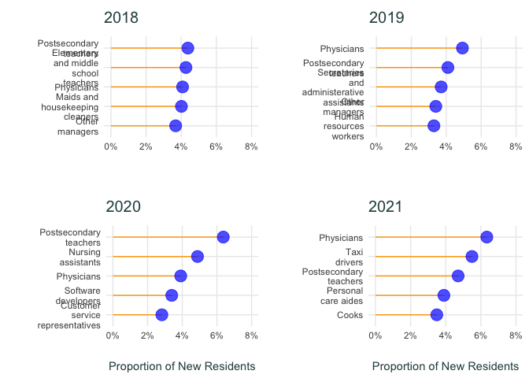
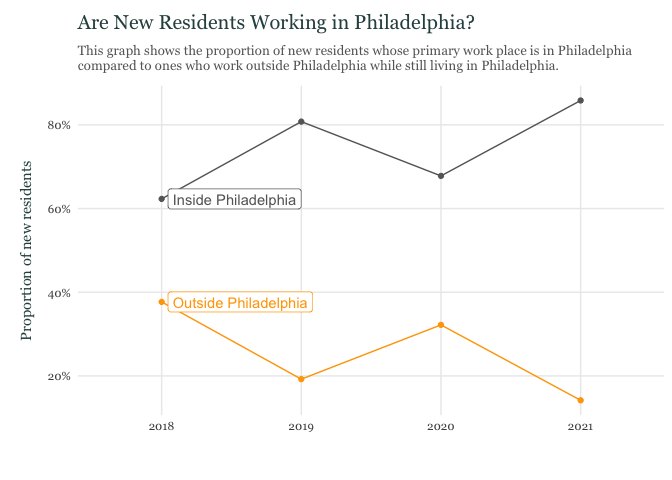
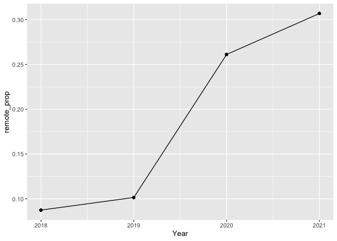

New Residents Patterns in Philadelphia: Part 3
================

## Data Sources

For this Leading Indicator, we collected data from the IPUMS USA micro
data series. We created a data extract from the [IPUMS
website](https://usa.ipums.org/usa/) for the following respondent-level
characteristics:

- SEX
- AGE
- RACE
- HISPAN (Hispanic origin)
- EDUC (Educational attainment)
- INCT (Total personal income)
- MIGPLAC1 (State or county of residence 1 year ago)
- MIGCOUNTY1 (County of residence 1 year ago)
- MIGTYPE1 (Metropolitan status 1 year ago)
- PWSTATE2 (Place of work: state)
- PWCOUNTY (Place of work: county)
- OCC (Occupation)
- TRANWORK (Means of transportation to work)

## Importing Data

``` r
dat <- read.csv("ipums_nresidents.csv")
```

## Cleaning Data

### Attaching survey weights

``` r
#_________________________________________#
# separating data into pre and post pandemic 
pre_COVID <- dat %>% 
  filter(YEAR == 2018 | YEAR == 2019)
post_COVID <- dat %>% 
  filter(YEAR == 2020 | YEAR == 2021)
#_________________________________________#
# attaching survey weights 
dtaDesign_pre <- svydesign(id      = ~CLUSTER,
                           strata  = ~STRATA,
                           weights = ~PERWT,
                           nest    = TRUE,
                           data    = pre_COVID)
#_________________________________________#
dtaDesign_post <- svydesign(id     = ~CLUSTER,
                           strata  = ~STRATA,
                           weights = ~PERWT,
                           nest    = TRUE,
                           data    = post_COVID)
```

## Cross Tabulations

### 1. Top 5 Occupations

``` r
# 1. Occupation => describe the top 10 jobs held by migrant workers 
table <- svytable(~OCC+YEAR, design = dtaDesign_pre)
df_pre <- as.data.frame.matrix(table) 
df_pre <- rownames_to_column(df_pre, var = "Variable") %>% as_tibble()
#_________________________________________#
table <- svytable(~OCC+YEAR, design = dtaDesign_post)
df_post <- data.frame(rbind(table))
df_post <- rownames_to_column(df_post, var = "Variable") %>% as_tibble()
#_________________________________________#
df_occ <- df_pre %>% 
  left_join(df_post, by = c("Variable")) %>% 
  filter(Variable != "")
# calculating top 10 OCCUPATIONS that new residents are working in 
df_occ <- df_occ %>% 
  gather(YEAR, count, `2018`:X2021) %>% 
  group_by(YEAR) %>% 
  arrange(desc(count)) %>%
  group_by(YEAR) %>% 
  mutate(prop_count = count/sum(count)) %>% 
  slice(1:5) %>% 
  mutate(Variable = ifelse(Variable == "Secretaries and administrative assistants, except legal, medical, and executive", "Secretaries and administerative assistants", Variable))
```

## Ranking of Top 5 Occupations Among New Residents

<!-- -->

### 2. Are New Residents Mostly Working in Philadelphia?

``` r
###########################################
# 6. Place of work => can point out whether numbers of migrants working outside PA 
# has increased since the pandemic or not
# separating data into pre and post pandemic 
#:::::::::::::::::::::::::::::::::::::::::
table <- svytable(~PWCOUNTY+YEAR, design = dtaDesign_pre)
df_pre <- as.data.frame.matrix(table) 
df_pre <- rownames_to_column(df_pre, var = "Variable") %>% as_tibble()
df_pre <- df_pre %>% 
  group_by(Variable) %>% 
  mutate(`Pre-COVID` = mean(`2018`:`2019`))
#_________________________________________#
table <- svytable(~PWCOUNTY+YEAR, design = dtaDesign_post)
df_post <- data.frame(rbind(table))
df_post <- rownames_to_column(df_post, var = "Variable") %>% as_tibble() 
df_post <- df_post %>% 
  group_by(Variable) %>% 
  mutate(`Post-COVID` = mean(X2020:X2021))
#_________________________________________#
df_pwork <- df_pre %>% 
  left_join(df_post, by = c("Variable"))
#_________________________________________#
# creating dummy of philly 
df_pwork <- df_pwork %>% 
  select(Variable, `2018`, `2019`, X2020, X2021) %>% 
  gather(Year, count, `2018`:X2021) %>% 
  mutate(Philly = ifelse(Variable == 101, "Philadelphia", "Not Philadelphia")) %>% 
  group_by(Year, Philly) %>% 
  mutate(sum_pwork = sum(count)) %>%
  group_by(Year) %>% 
  mutate(prop_pwork = sum_pwork/sum(count))
# creating lineplots of changing proportions in migrant workers working in philadelphia vs outside
df_pwork <- df_pwork %>% 
  mutate(Year = recode(Year,
                       "2018" = 2018,
                       "2019" = 2019,
                       "X2020" = 2020,
                       "X2021" = 2021)) %>% 
  distinct(prop_pwork, .keep_all = TRUE) %>% 
  group_by(Philly) %>% 
  mutate(index_prop = prop_pwork/prop_pwork[which(Year == 2018)])
# adding labels to maximum year in dataset 
df_pwork <- df_pwork %>% 
  mutate(label = ifelse(Philly == "Not Philadelphia" & Year == 2018, "Outside Philadelphia",
                        ifelse(Philly == "Philadelphia" & Year == 2018, "Inside Philadelphia", NA)))
# making visual change of migrants working outside vs. inside philly 
df_pwork %>% 
  ggplot(aes(x=as.factor(Year), y = prop_pwork, color = Philly, group = Philly)) + 
  geom_point() + geom_line() +
  scale_y_continuous(labels = scales::percent) + 
  labs(y="Proportion of new residents", x = "",
       title = "Are New Residents Working in Philadelphia?", 
       subtitle = "This graph shows the proportion of new residents whose primary work place is in Philadelphia \ncompared to ones who work outside Philadelphia while still living in Philadelphia.") + 
  scale_color_manual(values = c("orange", "grey40")) + 
  geom_label_repel(aes(label = label),
                   nudge_x = 0.1,
                   nudge_y = 0., 
                   na.rm = TRUE) +
  theme_minimal() + 
  theme(axis.title = element_blank(),
        #panel.grid.major.x = element_blank(),
        #panel.grid.major.y = element_blank(),
        panel.grid.minor = element_blank(),
        legend.title = element_blank(),
        legend.justification = c(0, 1),
        legend.background = element_blank(),
        legend.direction="vertical",
        legend.position = "none",
        legend.text = element_text(family = "Georgia"),
        text = element_text(family = "Georgia"),
        plot.title = element_text(size = 15, margin = margin(b = 10, t = 5), color = "darkslategrey"),
        plot.subtitle = element_text(size = 10, color = "grey40", margin = margin(b = 10)),
        plot.caption = element_text(size = 8, margin = margin(t = 10), color = "grey50", hjust = 0),
        axis.title.y = element_text(margin = margin(t = 0, r = 10, b = 0, l = 10), color = "darkslategrey", family = "Georgia"),
        axis.title.x = element_text(margin = margin(t = 20, r = 10, b = 0, l = 10), color = "darkslategrey", family = "Georgia"),
        axis.ticks.x = element_blank(),
        plot.margin = margin(0.2,0.2,0.2,0.2, "cm"))
```

<!-- -->

``` r
#:::::::::::::::::::#
#       2018
#:::::::::::::::::::#
# RECORDING PWCOUNTIES THAT CORRESPOND TO PWSTATES 
# COUNTY FIPS CODE: 91 => Montgomery County, PA
# COUNTY FIPS CODE: 7 => Camden County, NJ
# COUNTY FIPS CODE: 29 => Chester County, PA
# COUNTY FIPS CODE: 45 => Delaware County, PA
# COUNTY FIPS CODE: 17 => Bucks County, PA
#:::::::::::::::::::#
#       2020
#:::::::::::::::::::#
# RECORDING PWCOUNTIES THAT CORRESPOND TO PWSTATES 
# COUNTY FIPS CODE: 91 => Montgomery County, PA
# COUNTY FIPS CODE: 3 => New Castle, DE
# COUNTY FIPS CODE: 7 => Camden County, NJ
# COUNTY FIPS CODE: 15 => Gloucester County, NJ
# COUNTY FIPS CODE: 45 => Delaware County, PA
#:::::::::::::::::::#
#       2021
#:::::::::::::::::::#
# RECORDING PWCOUNTIES THAT CORRESPOND TO PWSTATES 
# COUNTY FIPS CODE: 61 => New York County, PA
# COUNTY FIPS CODE: 7 => Camden County, NJ
# COUNTY FIPS CODE: 91 => Montgomery County, PA
# COUNTY FIPS CODE: 17 => Bucks County, PA
#:::::::::::::::::::::::::::::::::::::::::
###########################################
```

### 3. Is Remote Work Higher among New Residents After COVID-19

``` r
# 7a. Remote work => is remote work higher in migrants who came to Philly after the pandemic
table <- svytable(~TRANWORK+YEAR, design = dtaDesign_pre)
df_pre <- as.data.frame.matrix(table) 
df_pre <- rownames_to_column(df_pre, var = "Variable") %>% as_tibble() 
#_________________________________________#
table <- svytable(~TRANWORK+YEAR, design = dtaDesign_post)
df_post <- data.frame(rbind(table))
df_post <- rownames_to_column(df_post, var = "Variable") %>% as_tibble()
#_________________________________________#
df_remote <- df_pre %>% 
  left_join(df_post, by = c("Variable"))
#_________________________________________#
# calculating proportion of remote work among new residents
df_remote <- df_remote %>% 
  gather(Year, count, `2018`:X2021) %>% 
  group_by(Year) %>% 
  mutate(remote_prop = count[which(Variable == "80")]/sum(count)
  )
###########################################
#visualizing changes in remote work props
df_remote %>% 
  mutate(Year = recode(Year,
                       "2018" = 2018,
                       "2019" = 2019,
                       "X2020" = 2020,
                       "X2021" = 2021)) %>% 
  ggplot(aes(Year, remote_prop)) + geom_point() + geom_line()
```

<!-- -->

#### 3. What are the top jobs among new residents who work remotely?
